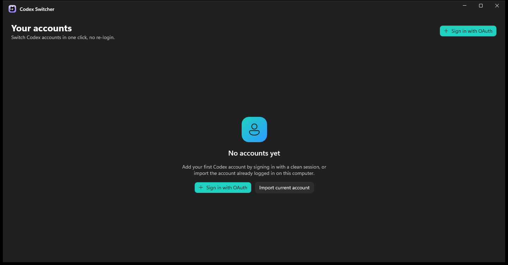

# Codex Account Switcher

> Switch between multiple **OpenAI Codex** accounts on Windows with one click — **without
> re-doing the OAuth login every time.**


Codex Account Switcher is a fast, native **Windows desktop app** (WinUI 3 / .NET 10) that manages
several Codex logins in an **encrypted local vault** and swaps the active one instantly. It keeps
every account **alive in the background** by refreshing tokens before they expire, so you never have
to sign in again just to switch.



---

## Contents

- [Why](#why)
- [Features](#features)
- [How it works](#how-it-works)
- [Requirements](#requirements)
- [Getting started](#getting-started)
- [Building](#building)
- [Configuration](#configuration)
- [Security](#security)
- [Project structure](#project-structure)
- [Tech stack](#tech-stack)
- [License](#license)

## Why

The Codex CLI, desktop app and IDE extension all read a single credential file:
`%USERPROFILE%\.codex\auth.json`. If you work with more than one Codex account, switching means
re-running the whole OAuth flow every time. This app turns that into a **one-click swap** while
treating your tokens like passwords.

## Features

- **Encrypted vault** — every `auth.json` is encrypted at rest with Windows **DPAPI**
  (`CurrentUser` scope). Tokens are never logged.
- **One-click switch** — writes the chosen account into the active slot **atomically**, with an
  automatic encrypted backup and full **rollback** if anything fails.
- **Never lose a login** — before overwriting, the current active account is **written back** to
  the vault, preserving tokens the Codex CLI rotated while you were using it.
- **Clean-session login** — adding an account opens a **disposable, incognito-style** WebView2
  session (no shared cookies/history). The OAuth URL comes from the `codex app-server` login flow
  and is opened only inside that clean WebView2 (never the system browser), so one account never
  contaminates another, and no ChatGPT "device code" security setting is required.
- **Built-in 2FA code generator** — a small tool (RFC 6238 TOTP) to paste a 2FA secret key and get a
  rotating 6-digit code with a live expiry countdown; the key stays in memory only.
- **Background refresh** — a scheduled task renews each account before the ~8-day expiry window,
  isolated via a temporary `CODEX_HOME` (never touching the real active slot).
- **Closes & reopens Codex apps** — detects running Codex desktop/CLI processes, asks for
  confirmation, closes them for the swap and reopens the desktop app afterwards.
- **Automatic language** — Portuguese on Brazilian/`pt` systems, English everywhere else.
- **Native Fluent UI** — Mica, dark/light, rounded corners, relative dates, health badges.

## How it works

Switching accounts = swapping the contents of `%USERPROFILE%\.codex\auth.json`. The app keeps an
encrypted copy of each account's `auth.json` in its vault (the **source of truth**) and performs the
swap as a reversible transaction: **confirm → close Codex apps → write-back current → backup →
write new slot (atomic) → update metadata → reopen apps**. If any step fails, the original slot is
restored from the backup and the apps are reopened on the original account.

## Requirements

- Windows 10 / 11 (x64)
- [.NET SDK 10](https://dotnet.microsoft.com/download) (to build)
- [`codex` CLI](https://www.npmjs.com/package/@openai/codex) on `PATH` (for login/refresh/reopen)
- WebView2 Evergreen Runtime (bundled with modern Windows; used only during login)

## Getting started

Grab a build (or produce one — see below) and run `CodexSwitcher.exe`. On first launch the app
offers to **import the account already logged into Codex** on your machine, or to **add a new one**
via a clean OAuth session.

## Building

### Option A — Command line (.NET CLI)

```powershell
# Build everything
dotnet build CodexSwitcher.slnx

# Run the tests (66)
dotnet test CodexSwitcher.slnx

# Run the app
dotnet run --project src/CodexSwitcher.App/CodexSwitcher.App.csproj -r win-x64
```

### Option B — Visual Studio Code

1. Install the **C# Dev Kit** extension.
2. Open the project folder. The repo ships a `.vscode/launch.json` and `tasks.json`.
3. Press **F5** (runs the `build` task, then launches the app). Or run the **publish-single-exe**
   task from *Terminal → Run Task*.

### Option C — Visual Studio 2022

Open `CodexSwitcher.slnx`, set **CodexSwitcher.App** as the startup project, choose the **x64**
configuration and press **F5**.

### Option D — Single self-contained `.exe`

Produces **one** file (no .NET required on the target, nothing else alongside):

```powershell
dotnet publish src/CodexSwitcher.App/CodexSwitcher.App.csproj -c Release -r win-x64 `
  -p:PublishSingleFile=true `
  -p:IncludeNativeLibrariesForSelfExtract=true `
  -p:DebugType=none -p:DebugSymbols=false
```

Output: `src/CodexSwitcher.App/bin/Release/net10.0-windows10.0.19041.0/win-x64/publish/CodexSwitcher.exe`
(~210 MB, self-contained). Don't rename the file after publishing: this unpackaged WinUI 3 app ties
its resource/manifest lookup to the exe's own filename, and renaming it breaks activation.

## Configuration

| Environment variable | Effect |
|---|---|
| `CODEXSWITCHER_LANG` | Force UI language: `pt` or `en` (otherwise auto-detected). |
| `CODEXSWITCHER_HOME` | Override the app data folder (vault, profiles, backups). Useful for testing/portability. |

## Security

- Tokens are treated like passwords: **encrypted at rest** (DPAPI `CurrentUser`), **never logged**,
  kept in memory as briefly as possible.
- DPAPI `CurrentUser` ties decryption to the same Windows user on the same machine — the vault is
  **not portable** across machines/users (by design).
- The only places a token exists in plaintext are the active slot required by Codex and the
  short-lived ephemeral login/refresh folders.
- The app never requires administrator privileges.

## Project structure

```
src/
  CodexSwitcher.Core     Models, services (Vault, Switch, Refresh, Reconciliation, Profiles)
  CodexSwitcher.Infra    DPAPI, atomic file system, config.toml, Codex CLI, process manager, scheduler
  CodexSwitcher.App      WinUI 3 UI (views, view models, ephemeral login, DI, localization)
tests/
  CodexSwitcher.Core.Tests   xUnit — vault, atomic writes, switch/rollback, refresh, reconciliation
```

## Tech stack

`Windows` · `.NET 10` · `C#` · `WinUI 3` · `Windows App SDK` · `WebView2` · `DPAPI` ·
`CommunityToolkit.Mvvm` · `xUnit`

## Keywords

OpenAI Codex account switcher, switch Codex accounts, multiple Codex accounts, Codex `auth.json`
manager, Codex multi-account, Codex login switcher, Windows WinUI 3 app, .NET 10 desktop app,
manage Codex CLI credentials, no re-login.

> Suggested GitHub topics: `openai-codex` `codex` `account-switcher` `windows` `winui3` `dotnet`
> `csharp` `webview2` `dpapi` `desktop-app`.

## License

[MIT](LICENSE)
